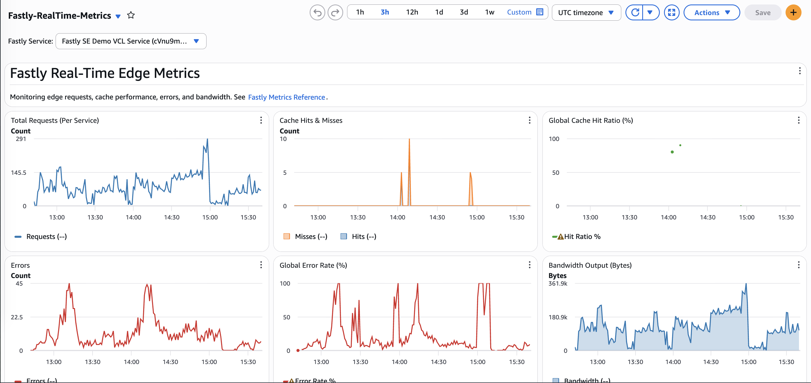
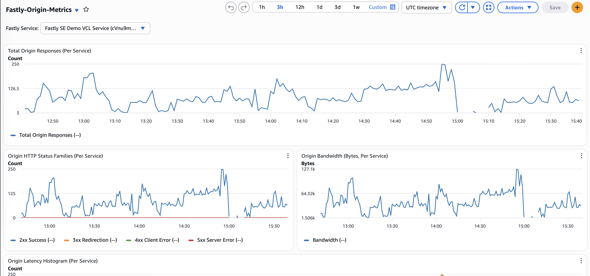

# Fastly Real-Time Metrics to CloudWatch

This project deploys AWS infrastructure to fetch Fastly real-time metrics and ingest them into [AWS CloudWatch](https://aws.amazon.com/cloudwatch/). This allows you to leverage CloudWatch's powerful alerting, dashboarding, and analytics tools on your Fastly CDN data.

## Dashboards

The project automatically provisions rich CloudWatch dashboards for both your Edge caching layer and your Origin connections, tracking the exact metrics you configure in your `metrics.ini`.

### Edge Dashboard


### Origin Dashboard


## Architecture

To meet the requirement of configurable, sub-minute data freshness (down to 1 second) while keeping costs extremely low, this project uses a serverless loop pattern:

1.  **[AWS EventBridge](https://aws.amazon.com/eventbridge/)** triggers an **[AWS Lambda](https://aws.amazon.com/lambda/)** function every 1 minute.
2.  The Python Lambda function reads a `POLL_INTERVAL_SECONDS` configuration and a `FASTLY_SERVICE_IDS` configuration (a comma-separated list of up to 10 services).
3.  Inside its 60-second execution window, the Lambda enters an asynchronous loop:
    *   Uses `asyncio` and `aiohttp` to fetch the latest metrics from the **[Fastly Real-Time Analytics API](https://www.fastly.com/documentation/reference/api/metrics-stats/realtime/)** (and optionally the **[Fastly Origin Inspector API](https://www.fastly.com/documentation/reference/api/metrics-stats/origin-inspector/real-time/)**) for all configured services *concurrently*.
    *   Pushes the aggregated metrics to **AWS CloudWatch** via the `boto3` `PutMetricData` API.
    *   Sleeps for the configured interval.
4.  Just as the 60 seconds are up, the Lambda exits, and EventBridge immediately triggers the next invocation.

Fastly API tokens are stored securely in **[AWS Secrets Manager](https://aws.amazon.com/secrets-manager/)**. 
All infrastructure is managed via **[Terraform](https://www.terraform.io/)**.

---

## Configuration (`metrics.ini`)

You can control exactly which metrics are fetched and pushed to CloudWatch by copying `metrics.ini.example` to `metrics.ini` in the root of the project and editing it. This allows you to manage your CloudWatch Custom Metric storage costs.

*   **Edge Metrics**: Enabled by default. You can track total requests, hits, errors, bandwidth, and specific HTTP status codes.
*   **Origin Metrics**: Disabled by default. If you have the Fastly Origin Inspector product enabled on your account, set `enabled = true` under `[origin]` to start tracking origin responses, origin status codes, origin bandwidth, and latency histograms.

---

## AWS Cost Analysis

The cost of running this project depends heavily on your configured `POLL_INTERVAL_SECONDS`.

AWS costs are driven by several factors:

**1. CloudWatch Custom Metrics (Storage):**
* Cost: $0.30 per metric / month.
* The default template tracks **55 Edge metrics** per Fastly Service (Origin metrics are disabled by default as they require a paid Fastly product).
* Enabling Origin metrics adds **38 more** (93 total), scaling to **~$27.90 / month** per service.
* *(Note: The Fastly Real-Time API actually exposes over 340 metric fields, plus ~160 more via Origin Inspector. You can add any field name to `metrics.ini` and it will be picked up with no code changes).*
* Cost for 1 Service (55 default metrics): **$16.50 / month**.
* Cost for 5 Services (55 metrics): **$82.50 / month**.
* Cost for 10 Services (55 metrics): **$165.00 / month**.
*(Note: Metric storage costs scale linearly based on how many metrics you enable in `metrics.ini` and how many Fastly Services you list in `FASTLY_SERVICE_IDS`)*

**2. CloudWatch `PutMetricData` API Requests:**
* By default, the Lambda batches data and pushes it every 5 seconds.
* `PutMetricData` costs $0.01 per 1,000 requests.
* Edge and Origin metrics are pushed to separate CloudWatch namespaces (`Fastly/RealTime` and `Fastly/OriginInspector`), so each requires its own API call. With only Edge metrics enabled: 1 request every 5 seconds = 518,400 requests / month = **~$5.18 / month**. With Origin metrics also enabled (the default `metrics.ini.example` has Origin disabled, but many users turn it on): 2 requests every 5 seconds = **~$10.37 / month**.
*(Note: If you track multiple Fastly services, all services' data for a namespace batches into the same API request, so this API cost is fixed per namespace and does NOT multiply per service!)*

**3. CloudWatch Alarms:**
* Cost: $0.10 per standard resolution alarm / month.
* By default, this project deploys 5 alarms **per Fastly Service** (Edge 5xx Spikes, Edge Zero Traffic, Edge Traffic Anomaly Detection, Origin 5xx Spikes, Origin Latency Spikes), plus 1 global Lambda-errors system alarm.
* Cost for 1 Service (5 alarms + 1 system alarm): **$0.60 / month**.
* Cost for 5 Services (25 alarms + 1 system alarm): **$2.60 / month**.
* Cost for 10 Services (50 alarms + 1 system alarm): **$5.10 / month**.
*(Note: You can easily toggle these alarms off or add your own in `terraform/variables.tf` and `terraform/alarms.tf`)*

**4. Lambda Compute Time:**
* Costs $0.0000166667 per GB-second.
* For a 60-second interval, the Lambda only runs for a couple of seconds per minute. 
* For any interval under 60 seconds, the Lambda runs continuously for the full minute to maintain the polling loop.

### High-Resolution Metrics
By default, the Lambda accumulates traffic data every 5 seconds and pushes it to standard 60-second CloudWatch resolution. This guarantees your traffic totals are 100% accurate while keeping costs low.

If you specifically want to see sub-minute granularity drawn on your CloudWatch charts, you can set `enable_high_resolution_metrics = true` in your `terraform.tfvars`. 
* **Storage Cost Impact**: $0 (Standard and High-Res metrics both cost $0.30/metric).
* **API Cost Impact**: $0 (Data is still batched).
* **Alarm Cost Impact**: **High**. If you create CloudWatch Alarms based on high-resolution data, they cost **$0.30 per alarm** (instead of $0.10 for standard alarms). Only enable this if you need sub-minute alerting!

### Estimated Monthly Costs by Polling Interval

*The following estimates cover the polling-driven costs (API requests + Lambda compute) with Origin metrics disabled (the shipped default) — enabling Origin metrics roughly doubles the `PutMetricData` API column, since it pushes to a second namespace. Metric storage scales separately with your `metrics.ini` selection as shown above. These estimates assume you are **not** using the AWS Free Tier. If your account qualifies for the Free Tier, your Lambda compute and initial CloudWatch requests will be largely free, bringing these costs down significantly.*

| Polling Interval | `PutMetricData` API Costs | Lambda Compute (256MB) | Base Costs (55 Edge Metrics + Alarms + Logs) | **Estimated Total Cost / Month** |
| :--- | :--- | :--- | :--- | :--- |
| **1 second** | ~$25.92 / mo | ~$8.64 (ARM64 Continuous) | ~$17.10 | **~$51.66 / month** |
| **5 seconds** | ~$5.18 / mo | ~$8.64 (ARM64 Continuous) | ~$17.10 | **~$30.92 / month** |
| **10 seconds** | ~$2.59 / mo | ~$8.64 (ARM64 Continuous) | ~$17.10 | **~$28.33 / month** |
| **20 seconds** | ~$1.30 / mo | ~$8.64 (ARM64 Continuous) | ~$17.10 | **~$27.04 / month** |
| **30 seconds** | ~$0.86 / mo | ~$8.64 (ARM64 Continuous) | ~$17.10 | **~$26.60 / month** |
| **60 seconds (Default)** | ~$0.43 / mo | ~$0.28 (ARM64 Batched) | ~$17.10 | **~$17.81 / month** |

**Cost Insights:**
*   **The 60-second drop-off:** Polling at 60 seconds is by far the cheapest polling-driven cost (~$0.71/mo combined) because the Lambda function no longer has to run continuously; it wakes up, runs once, and immediately goes to sleep. The bulk of the table's total is your metric storage selection, not polling.
*   **The 1-second premium:** Polling at 1-second intervals generates a massive amount of CloudWatch API requests, which becomes the dominant polling-driven cost (~$34.56/mo of the ~$51.66/mo total).
*   **The sweet spot:** A 10-to-20 second interval keeps the polling-driven cost to a couple of dollars a month, so the total is dominated by however many metrics you choose to store — tune `metrics.ini` for cost, not the polling interval.

## Getting Started

### Prerequisites
1.  **Fastly API Token:** You must generate a Fastly API token. 
    *   **Role/Scope:** The token only requires `global:read` access.
    *   **Service Access:** You can safely restrict the token to specific services, or allow access to "All Services".
2.  **AWS Credentials:** AWS CLI installed and authenticated.

### Deployment
We provide a wrapper script that automatically packages the Python Lambda dependencies and runs Terraform.

1.  Run the deployment script:
    ```bash
    ./deploy.sh
    ```
2.  Terraform will prompt you for the required values (or you can set them in `terraform/terraform.tfvars`):
    *   `fastly_api_key`: Your Fastly API token.
    *   `fastly_service_ids`: A comma-separated list of service IDs (e.g., `SU1Z0isxPaozGVKXdv0eY,1xyz2...`).
    *   `poll_interval_seconds`: How often to poll in seconds (e.g., `10`).

*(Alternatively, you can copy the provided `terraform/terraform.tfvars.example` file to `terraform/terraform.tfvars` and fill it out to supply these automatically and configure advanced options like Alert Emails).*

3.  *(Optional)* Customize your metrics by copying `metrics.ini.example` to `metrics.ini` and editing it. If you don't provide one, the default example configuration will be used automatically.

### Teardown
To cleanly remove all AWS resources (Lambda, IAM roles, EventBridge rules, and Secrets), run:
```bash
./teardown.sh
```

## License

This project is licensed under the **Apache License 2.0 with the Commons Clause v1.0**.

You are free to download, use, modify, and distribute this software for internal, personal, or academic purposes. However, you **may not sell** the software or provide it as a managed commercial service where its value derives entirely or substantially from the software's functionality. 

See the [LICENSE](LICENSE) file for the full license text.
